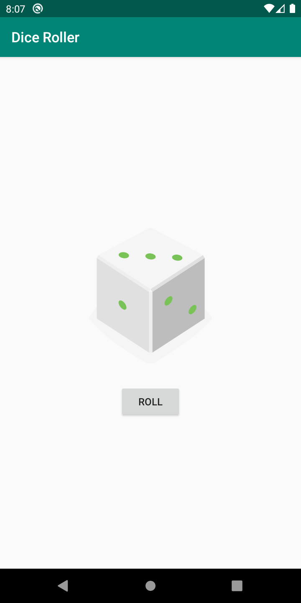

## Lesson 1 (DiceRoller)

  

## Description
Build your first app: "Dice Roller" that covers basic Android components like displaying texts and images as well as a tour of the Android tools you'll be using throughout this course.